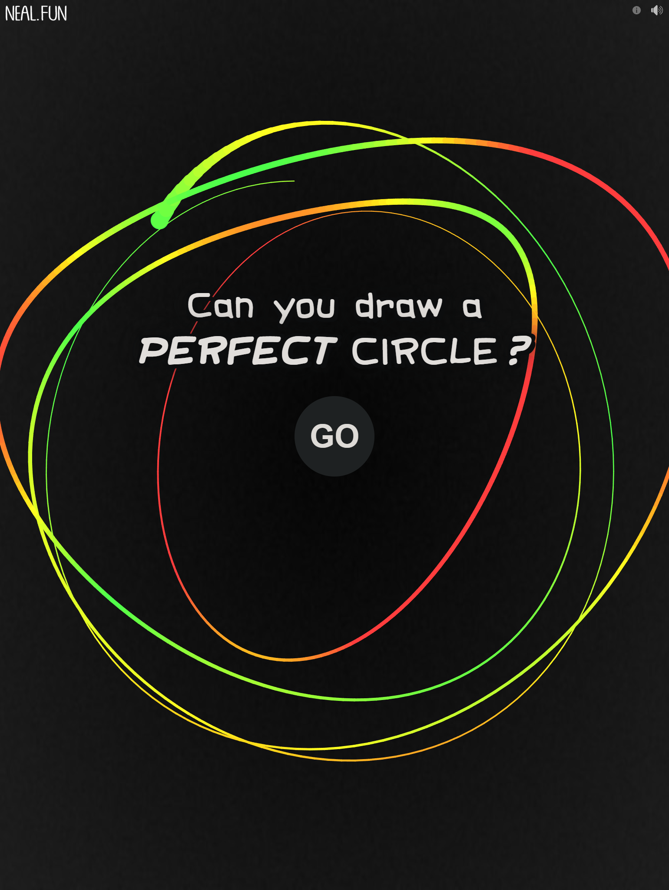

# Perfect Circle

<p align="center">
  
</p>

This project automates drawing a perfect circle in a web game where the objective is to draw a circle as accurately as possible. The program captures two mouse positions and then simulates drawing a perfect circle that passes through both points.

The game can be played at https://neal.fun/perfect-circle/

## Overview

The program performs the following steps:

1. **Waits for 2 seconds**: Allows you to position the mouse at the first point (`p1`).
2. **Captures the first mouse position** (`p1`).
3. **Waits for another 2 seconds**: Allows you to move the mouse to the second point (`p2`).
4. **Captures the second mouse position** (`p2`).
5. **Calculates the circle's center and radius** so that both `p1` and `p2` lie on the circumference.
6. **Simulates drawing the circle** starting from `p1`, moving the mouse along calculated points.
7. **Completes the circle**, ending at `p1`.

## How It Works

- **Mouse Position Capture**: Uses the Windows API to get the current mouse position.
- **Circle Calculation**:
  - The center is calculated as the midpoint between `p1` and `p2`.
  - The radius is the distance from the center to either point.
  - The initial angle `theta0` is calculated so that drawing starts from `p1`.
- **Mouse Movement Simulation**:
  - The program simulates mouse movements along the circle's circumference.
  - It uses the Windows API to move the mouse cursor and simulate mouse button presses/releases.

## Requirements

- **Operating System**: Windows (due to the use of Windows-specific APIs).
- **Rust**: Ensure you have Rust installed. You can download it from [rust-lang.org](https://www.rust-lang.org/tools/install).

## Usage

1. **Clone the Repository**:

   ```bash
   git clone https://github.com/TeamDman/perfect-circle.git
   cd perfect-circle
   ```

2. **Build the Program**:

   ```bash
   cargo build --release
   ```

3. **Run the Program**:

   ```bash
   cargo run --release
   ```

4. **Interact with the Program**:

   - After running, the program waits for 2 seconds.
   - **First Point**: Move your mouse to the desired starting point (`p1`) during this time.
   - The program captures the first position.
   - It waits for another 2 seconds.
   - **Second Point**: Move your mouse to the second point (`p2`) during this time.
   - The program captures the second position.
   - It then moves the mouse back to `p1` and starts drawing the circle.

5. **Enjoy the Result**:

   - The program will draw a perfect circle passing through both `p1` and `p2`.
   - Use this in the web game to achieve a high score!

## Screenshots

Below are screenshots of the game starting page and a successful circle drawn by the program:

<p align="center">
  
  
</p>

## Notes

- **Safety**: Be cautious when running programs that control mouse movements. Ensure that you don't have unsaved work in other applications to prevent unintended interactions.
